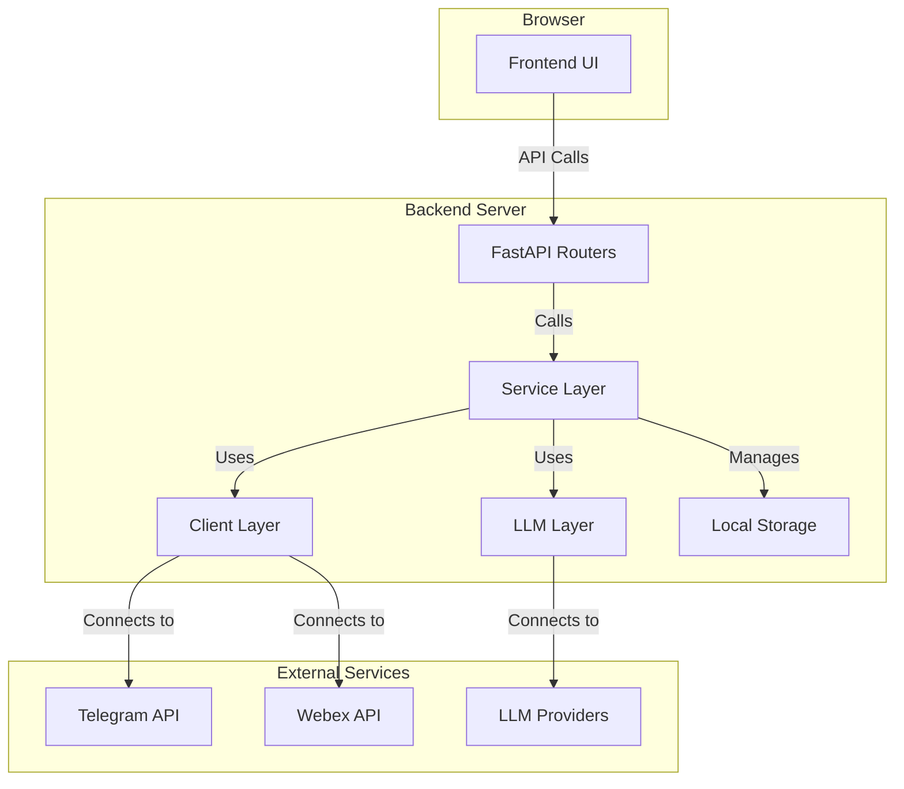

# System Architecture

## 1. Core Components
The application follows a classic 3-tier architecture:
- **Frontend (Presentation Layer):** A standard single-page application built with HTML, CSS, and vanilla JavaScript, located in the `static/` directory.
- **Backend (Business/Application Layer):** A Python-based API built with the FastAPI framework. This layer contains all business logic, service integrations, and API endpoints.
- **Data & Integration Layer:** This is not a traditional database but a collection of clients and managers that interact with external services (Telegram, Webex, LLM providers) and local storage (session files, cache).

## 2. Component Relationships & Data Flow

## 3. Key Technical Decisions & Design Patterns
- **Service-Oriented Architecture:** The backend logic is cleanly separated into distinct services (`auth_service`, `chat_service`, `bot_service`, `download_service`), promoting modularity and maintainability.
- **Factory Pattern:** Used in both the `clients/` and `ai/` directories to abstract the creation of specific client instances. This allows the application to support multiple chat platforms and LLM providers with a consistent interface.
- **Abstract Base Classes (ABCs):** The `clients/base_client.py` and `ai/base_llm.py` define abstract interfaces (`ChatClient`, `LLMClient`) that all concrete implementations must adhere to. This enforces a contract and ensures interchangeability.
- **Dependency Injection:** FastAPI's dependency injection system is used to provide access to shared resources like the `LLMManager` within API routes.
- **Stateless Authentication:** While session data is stored on the server, the frontend interacts with the backend via session tokens, making the API calls themselves stateless.

## 4. Critical Implementation Paths
- **Authentication Flow:**
  1. Frontend requests login from `routers/auth.py`.
  2. `auth_service.py` calls the appropriate client (`telegram_client_impl.py` or `webex_client_impl.py`).
  3. The client handles the service-specific auth dance (phone code or OAuth).
  4. Upon success, `auth_service.py` creates a session and returns a token to the frontend.
- **Chat Analysis Flow:**
  1. Frontend sends a request to `POST /api/chat` in `routers/chat.py`.
  2. The router calls `services/chat_service.py:process_chat_request`.
  3. `chat_service` gets the appropriate chat client via the factory to fetch messages.
  4. The client (`telegram_client_impl.py` or `webex_client_impl.py`) retrieves messages, handling caching and timezone conversions.
  5. `telegram_client_impl.py` performs its complex thread reconstruction logic.
  6. `chat_service` formats the messages and sends them to the `llm/llm_client.py:LLMManager`.
  7. `LLMManager` routes the request to the correct LLM provider.
  8. The response is streamed back through the layers to the frontend.
- **Bot Webhook Flow:**
  1. Telegram/Webex sends an event to the webhook endpoint in `routers/bots.py`.
  2. The router passes the request to `services/bot_service.py`.
  3. `bot_service` parses the command, manages conversation state (e.g., `/aimode`), and uses the `chat_service` and `llm_client` to generate a response.
  4. The response is sent back to the chat platform via the appropriate bot client.

## 5. Source Code Paths
- **Main Application:** [`app.py`](./app.py)
- **API Endpoints:** [`routers/`](./routers/)
- **Core Business Logic:** [`services/`](./services/)
- **External Service Clients:** [`clients/`](./clients/)
- **LLM Integration:** [`llm/`](./llm/), [`ai/`](./ai/)
- **Frontend:** [`static/`](./static/)