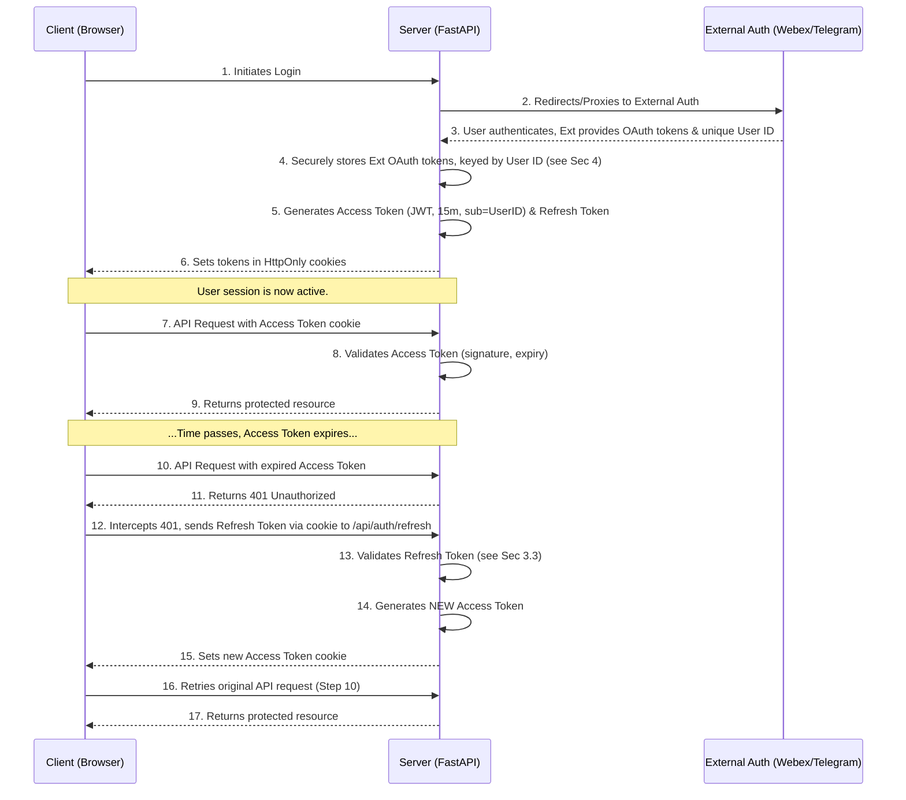

# Chat Analyzer: Security Architecture & Hardening Guide

Document Version: 1.1

Date: 2025-07-28

## 1\. Overview

This document defines the security architecture for the Chat Analyzer application. Its primary goal is to establish a robust, modern security posture by addressing current vulnerabilities in session management, credential storage, and public-facing endpoints. The architecture is designed to be implemented in phases, providing immediate security uplifts while paving the way for a more scalable, stateful-backend model.

The core tenets of this architecture are:

- **Defense in Depth:** Employing multiple layers of security controls.
    
- **Principle of Least Privilege:** Ensuring components only have the access they require.
    
- **Secure by Default:** Choosing secure patterns and configurations.
    
- **Separation of Concerns:** Clearly distinguishing between the application's internal authentication and the management of external service credentials.
    

## 2\. Threat Model & Key Risks

The architecture is designed to mitigate the following primary threats:

- **Session Hijacking:** An attacker gaining access to a user's active session token.
    
- **Credential Compromise:** An attacker gaining access to the application's stored third-party credentials (e.g., Webex OAuth tokens, LLM API keys).
    
- **Insecure Webhooks:** An attacker spoofing requests to the bot's webhook endpoints to trigger unauthorized actions.
    
- **Cross-Site Scripting (XSS):** An attacker injecting malicious scripts into the frontend via chat history or AI responses.
    

## 3\. Authentication & Session Management

The cornerstone of the new architecture is a standard **JWT Access/Refresh Token Grant Flow**. This replaces the current insecure, non-expiring token system.

### 3.1. Token Strategy

- **Access Token (JWT):**
    
    - **Purpose:** To authorize requests to our backend API. **It is never sent to external services like Webex.**
        
    - **Type:** Signed JWT (JWS).
        
    - **Payload Claims:** `sub` (user_id from the external service), `exp` (expiration), `iat` (issued at).
        
    - **Lifetime:** Short (e.g., **15 minutes**).
        
    - **Storage (Client):** `HttpOnly`, `Secure` cookie with `SameSite=Strict`.
        
- **Refresh Token (Opaque String or JWT):**
    
    - **Purpose:** To obtain a new Access Token without user re-authentication.
        
    - **Type:** A cryptographically secure random string or a self-contained JWT.
        
    - **Lifetime:** Long (e.g., **7 days**).
        
    - **Storage (Client):** `HttpOnly`, `Secure` cookie with `SameSite=Strict` and a restricted path (e.g., `/api/auth/refresh`).
        

### 3.2. Authentication Flow

### 3.3. Session Revocation & Refresh Token Validation

To mitigate the risk of a compromised long-lived refresh token, we must have a server-side revocation mechanism.

- **Phase 1 (Stateless):** The refresh token will be a self-contained JWT. The server will validate its signature and expiry. **Revocation** is not possible in this **phase.** This is an accepted trade-off for a rapid security uplift without new dependencies.
    
- **Phase 2 (Stateful - Target Architecture):**
    
    1.  **Redis Allowlist:** A Redis set will be maintained for each user, containing the hashes of all their active refresh tokens (e.g., `user:{user_id}:refresh_tokens`).
        
    2.  **Validation:** Upon receiving a refresh request, the server hashes the token and checks for its existence in the Redis set. If not found, the request is rejected.
        
    3.  **Logout:** When a user logs out, their refresh token hash is explicitly deleted from the Redis set, immediately invalidating the session.
        

## 4\. Credential Management & "Security by Delegation"

The application's ability to read chat history relies on securely managing and using the user's external service credentials. The JWT `sub` claim serves as the link between our internal session and this external credential store.

### 4.1. Secure Storage of External Credentials

The raw OAuth tokens (Webex) and session files (Telegram) are highly sensitive and will be stored securely on the server.

- **Phase 1 (Interim - Encrypted File):**
    
    - **Mechanism:** A single file on the server (e.g., `sessions.enc`) will store a JSON object mapping user IDs to their credentials.
        
    - **Encryption:** This file will be encrypted at rest using a symmetric encryption library like `cryptography.fernet`.
        
    - **Key Management:** The encryption key will **NOT** be stored on the filesystem. It will be loaded exclusively from an environment variable (`APP_ENCRYPTION_KEY`).
        
    - **In-Memory Handling:** The file will be decrypted into memory only when needed and the decrypted content will not be persisted.
        
- **Phase 2 (Target Architecture - Redis):**
    
    - **Mechanism:** All external credentials will be migrated from the encrypted file into Redis.
        
    - **Data Structure:** Redis Hashes will be used to store credentials, keyed by user ID (e.g., `HSET user:{user_id} webex_access_token "..."`).
        
    - **Benefits:** This approach is significantly more performant, scalable, and handles concurrency safely compared to file-based storage.
        

### 4.2. The Delegation Flow (Post-Refactor)

1.  **Trigger:** A bot webhook is received or a user makes a request.
    
2.  **Authentication:** The backend validates the user's JWT Access Token and extracts the `sub` claim (the external User ID).
    
3.  **Retrieve Credentials:** The application uses the `sub` value as a key to look up the user's credentials from the secure store (the encrypted file in Phase 1, Redis in Phase 2).
    
4.  **Act on Behalf:** The application uses the retrieved credentials to instantiate the appropriate `ChatClient` (`WebexClientImpl` or `TelegramClientImpl`) and fetch the chat history.
    
5.  **Respond as Bot (if applicable):** The application uses the bot's own token (loaded from env vars) to post the result.
    

## 5\. Endpoint & Secret Management

### 5.1. Webhook Security

The Telegram webhook will be secured by validating the `X-Telegram-Bot-Api-Secret-Token` header. The secret used for validation will be a high-entropy random string loaded from an environment variable (`TELEGRAM_WEBHOOK_SECRET`). The bot token will be removed from the URL path.

### 5.2. Application Secret Management

All secrets—database credentials, API keys, JWT signing keys, encryption keys—will be removed from the `config.json` file and managed exclusively through environment variables, loaded via a `.env` file for local development. This aligns with standard twelve-factor app principles.